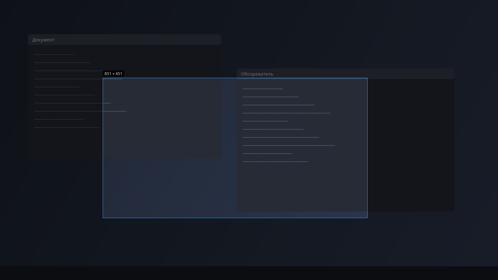
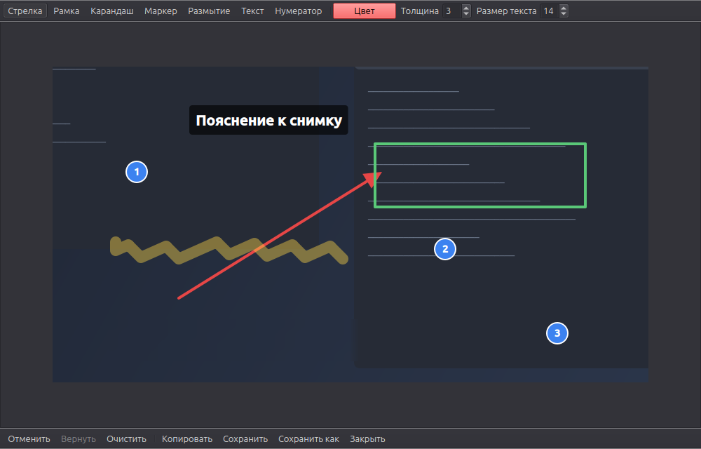
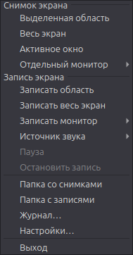
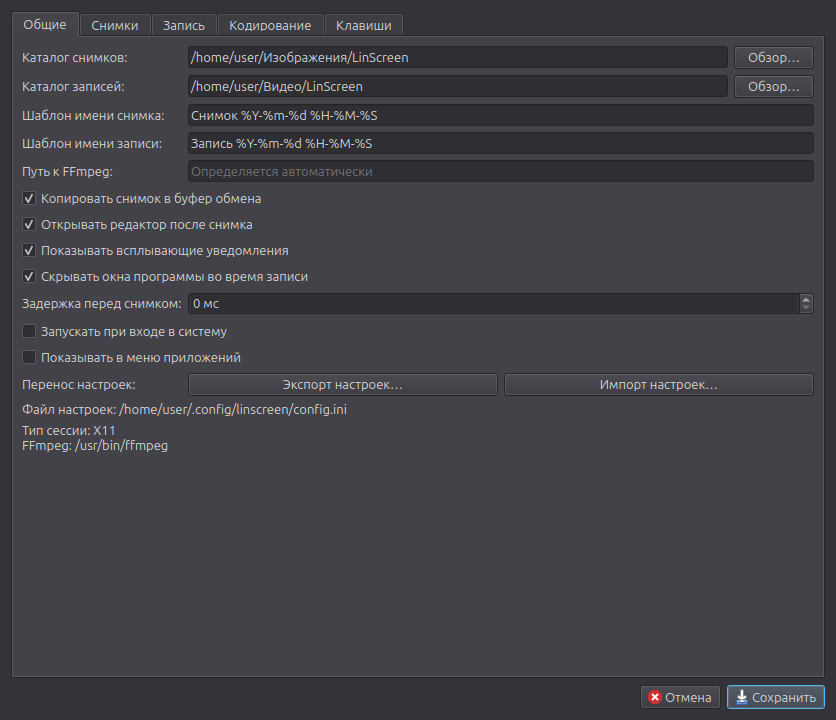
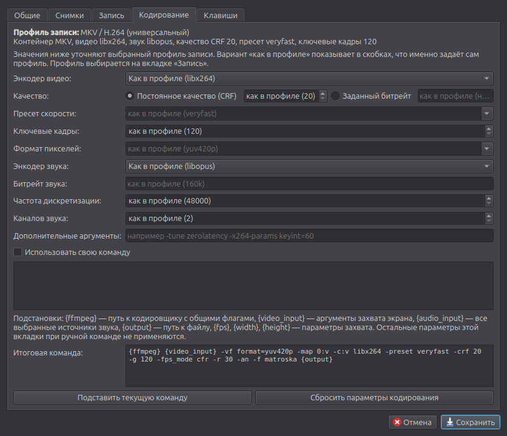

# LinScreen

Снимки экрана, запись видео и редактор аннотаций для Linux — в одном
приложении, живущем в системном трее.

Приложение не изобретает кодеки и не тянет тяжёлых зависимостей: захват и
кодирование выполняет FFmpeg, звук берётся у PulseAudio или PipeWire,
снимки в Wayland получает штатный портал рабочего стола. Всё это упаковано
в один запускаемый файл, которому не нужны ни Python, ни Qt, ни
установленный ffmpeg.



## Возможности

**Снимки экрана**

* выделенная область, весь экран, активное окно, отдельный монитор;
* форматы PNG, JPEG, WEBP, AVIF и BMP с настройкой качества и сжатия;
* копирование в буфер обмена, быстрое сохранение, сохранение с выбором пути;
* задержка перед снимком, чтобы успеть раскрыть меню или подсказку.

**Редактор аннотаций**



Открывается сразу после снимка: стрелка, рамка, карандаш, маркер,
размытие, текст с подложкой и круговой нумератор шагов. Готовые аннотации
перемещаются мышью, действия отменяются и возвращаются. Размытие
необратимо уничтожает содержимое области, а не закрывает его сверху, —
годится для скрытия паролей и личных данных.

**Запись экрана**

* область, весь экран или отдельный монитор;
* контейнеры MKV, MP4, WebM, MOV, AVI и профили H.264, H.265, AV1, VP9,
  FFV1, ProRes;
* анимации GIF (два прохода с палитрой), Animated WebP и APNG;
* звук с системного вывода и микрофона, включая раздельные подписанные
  дорожки и сведение;
* пауза и продолжение записи без перекодирования;
* корректная остановка и аварийное сохранение материала при сбое.

**Работа в трее**



Значок показывает состояние цветом, меню даёт доступ ко всем действиям.
Во время записи окна программы скрываются, чтобы не попасть в кадр.

## Установка

Скачайте `LinScreen-x86_64.AppImage` из раздела
[Releases](../../releases), разрешите запуск и запускайте:

```bash
chmod +x LinScreen-x86_64.AppImage
./LinScreen-x86_64.AppImage
```

Главного окна нет — значок появляется в системном трее. Одиночный щелчок
по значку делает снимок выделенной области.

Ярлык в меню приложений и автозапуск включаются галочками в
«Настройки → Общие», вручную ничего прописывать не нужно.

Проверка работоспособности выводит найденный FFmpeg, доступные кодеки,
звуковые источники и состояние составных частей:

```bash
./LinScreen-x86_64.AppImage --check
```

### Требования

Любой настольный дистрибутив Linux с graphical-сессией X11, системным
треем и FUSE (последний есть в любом настольном окружении и нужен самому
формату AppImage). Ничего доустанавливать не требуется: FFmpeg, Qt и
Python вложены внутрь.

## Использование

### Снимки

| Действие | Как |
|---|---|
| Область | щелчок по значку в трее либо «Выделенная область» в меню |
| Весь экран, активное окно, отдельный монитор | пункты меню |
| Отмена выделения | `Esc`, правая кнопка мыши |
| Выбрать весь экран во время выделения | `Enter` |

Снимок по умолчанию копируется в буфер обмена и открывается в редакторе.
Файлы попадают в каталог из настроек, по умолчанию — `Изображения/LinScreen`.

### Редактор

| Действие | Клавиши |
|---|---|
| Выбор инструмента | `1`…`7` в порядке кнопок на панели |
| Удалить выбранную аннотацию | `Delete` |
| Отменить, вернуть | `Ctrl+Z`, `Ctrl+Shift+Z` |
| Копировать результат и закрыть | `Ctrl+C` |
| Сохранить и закрыть | `Ctrl+S` |
| Сохранить как | `Ctrl+Shift+S` |
| Закрыть без сохранения | `Esc` |

Крупный снимок вписывается в окно, масштаб меняется колесом мыши.

### Запись

1. Выберите источник звука: меню трея → «Источник звука».
2. Запустите запись пунктом меню или горячей клавишей.
3. Остановите тем же сочетанием либо через меню.

Файлы попадают в каталог из настроек, по умолчанию — `Видео/LinScreen`.

Пауза разбивает запись на фрагменты и склеивает их без перекодирования,
поэтому качество не страдает. При продолжении теряется около четверти
секунды — столько занимает повторный запуск захвата.

Раздельные звуковые дорожки поддерживают MKV, MP4 и MOV: в плеере будут
две подписанные дорожки. В WebM и AVI звук автоматически сводится в одну.

Закрытие программы во время записи не обрывает её: файл корректно
дописывается, и только потом приложение завершается. То же происходит при
выходе из сеанса.

## Горячие клавиши

| Действие | Сочетание по умолчанию |
|---|---|
| Снимок области | `Print` |
| Снимок всего экрана | `Shift+Print` |
| Снимок активного окна | `Alt+Print` |
| Запись области: начать и остановить | `Ctrl+Alt+R` |
| Пауза записи | `Ctrl+Alt+P` |

Запись начинается и останавливается **одним сочетанием**: во время съёмки
окна программы скрыты, и запоминать вторую комбинацию не приходится.

Изменяются в «Настройки → Клавиши», поле заполняется самим нажатием.
Перехват в X11 не монопольный: если клавиша уже занята другой программой
(например, штатным снимком экрана рабочего стола), сработают обе. В этом
случае комбинацию следует сменить либо освободить в конфликтующей
программе.

Буквенные сочетания работают при любой раскладке клавиатуры.

## Язык интерфейса

По умолчанию интерфейс русский. Английский выбирается в «Настройки →
Общие → Язык интерфейса» и применяется сразу после сохранения; вариант
«Как в системе» определяет язык по переменным окружения.

Переводы хранятся отдельными файлами в каталоге `locale`: ключом служит
исходная русская строка, значением — её перевод.

```json
{
 "Записать область": "Record region",
 "Остановить запись": "Stop recording"
}
```

Чтобы добавить новый язык, достаточно положить рядом файл `<код>.json`
по образцу `locale/en.json` — приложение само найдёт его и предложит в
настройках. Строка без перевода показывается на исходном языке, поэтому
неполный словарь ничего не ломает.

## Настройки



Настройки хранятся в `~/.config/linscreen/config.ini` — обычном текстовом
файле с заголовками разделов и примечанием к каждому значению:

```ini
# Параметры записи экрана
[video]
# Профиль записи, например mkv_h264, mp4_h264, webm_vp9, gif
profile_id = mkv_h264
# Частота кадров захвата
fps = 30
# Записывать указатель мыши: да или нет
show_cursor = да
```

Править файл можно вручную любым редактором. Кнопки «Экспорт настроек…»
и «Импорт настроек…» переносят его целиком, что позволяет держать
несколько наборов или переносить настройки между машинами. Повреждённый
файл не мешает запуску: неверные значения отбрасываются, недостающие
берутся по умолчанию.

Флажок «Скрывать окна программы во время записи» убирает с экрана панель
записи и открытые окна, чтобы они не попали в кадр. Флажок «Показывать
всплывающие уведомления» отключает только всплывающие окна — сообщения
продолжают записываться в журнал.

## Настройка кодирования



Вкладка «Кодирование» уточняет выбранный профиль: энкодер видео и звука,
постоянное качество (CRF) либо заданный битрейт, пресет скорости,
интервал ключевых кадров, формат пикселей и произвольные дополнительные
аргументы.

Наверху вкладки показано название выбранного профиля и заданные им
значения, а в каждом поле вариант «как в профиле» дополнен конкретным
значением в скобках. Внизу выводится итоговая команда, которая будет
выполнена: она меняется вместе с настройками, поэтому результат виден до
начала записи.

Флажок «Использовать свою команду» передаёт сборку команды пользователю
целиком. В образце доступны подстановки:

| Подстановка | Чем заменяется |
|---|---|
| `{ffmpeg}` | путь к кодировщику вместе с общими флагами |
| `{video_input}` | аргументы захвата экрана выбранной области |
| `{audio_input}` | аргументы всех выбранных источников звука |
| `{output}` | путь к файлу результата |
| `{fps}`, `{width}`, `{height}` | параметры захвата по отдельности |

Кнопка «Подставить текущую команду» заполняет поле готовым образцом
выбранного профиля — его остаётся только поправить. Обозначение
`{output}` обязательно, иначе команда отклоняется до начала записи. Флаги
передачи прогресса и остановки подставляются принудительно, поэтому
счётчик и остановка работают и с ручной командой.

## Диагностика

Пункт «Журнал…» в меню трея показывает команды, переданные FFmpeg, и его
вывод; тот же текст пишется в `~/.cache/linscreen/linscreen.log`.
Необработанные ошибки записываются в `~/.cache/linscreen/crash.log`.
Окно настроек на вкладке «Общие» показывает найденный бинарник FFmpeg,
его версию и перечень недостающих возможностей сборки.

Ошибка внутри обработчика события не прекращает работу приложения: она
записывается в файл, а окно с сообщением показывается только один раз за
запуск.

## Сборка из исходников

```bash
git clone https://github.com/khameleonium/LinScreen.git
cd LinScreen
./build.sh
```

Сценарий создаёт виртуальное окружение, загружает сборку FFmpeg и
упаковывает результат в `dist/LinScreen-x86_64.AppImage` (около 130 МБ).

Образ AppImage монтируется при запуске, а не распаковывается во временный
каталог, поэтому стартует примерно за полсекунды вместо трёх секунд у
обычного единого файла и не изнашивает накопитель.

Другие виды сборки:

```bash
LINSCREEN_FORMAT=onefile ./build.sh    # один файл PyInstaller
LINSCREEN_FORMAT=dir ./build.sh        # каталог без упаковки
LINSCREEN_BUNDLE_FFMPEG=0 ./build.sh   # без вложенного ffmpeg
```

Запуск из исходных текстов:

```bash
sudo apt install ffmpeg libxcb-cursor0
python3 -m venv .venv
.venv/bin/pip install -r requirements.txt
.venv/bin/python main.py
```

## Устройство проекта

```
core/     настройки, определение сессии, хоткеи, автозапуск, фоновые вызовы
capture/  захват экрана, порталы рабочего стола, звуковые устройства
encoder/  профили FFmpeg, контроллер процессов, сохранение изображений
editor/   графический холст аннотаций
ui/       трей, оверлей выделения, панель записи, настройки, журнал
locale/   словари перевода интерфейса
tests/    модульные проверки
app.py    связывание модулей в рабочий цикл
main.py   точка входа, режимы --check и --version
```

Ключевые решения: внешние процессы выполняются неблокирующе, интерфейс не
подвисает ни при кодировании, ни при ожидании ввода-вывода; аргументы
командной строки передаются списками без сборки строки, поэтому пробелы и
спецсимволы в путях безопасны; профили кодирования отделены от запуска
процессов, что позволяет проверять формируемые команды без обращения к
системе.

Проверки:

```bash
.venv/bin/python -m unittest discover -s tests -t .
.venv/bin/python -m flake8 .
.venv/bin/python -m mypy .
```

## Состояние поддержки Wayland

Снимки экрана в Wayland работают через портал `org.freedesktop.portal.Screenshot`.

Запись экрана реализована по пути «портал ScreenCast → PipeWire → FFmpeg»,
но для работы требуются два условия: бэкенд портала с интерфейсом
`ScreenCast` (пакеты `xdg-desktop-portal-gnome`, `-kde`, `-wlr` или
`-hyprland`) и FFmpeg с фильтром `pipewiregrab`. Вложенная сборка FFmpeg
этого фильтра не содержит, поэтому в собранном виде запись доступна
только в X11; приложение сообщает конкретную причину недоступности.

Глобальные клавиши в Wayland требуют портала `GlobalShortcuts`; при его
отсутствии действия остаются доступными через меню значка в трее.

## Лицензия

Код распространяется по лицензии [MIT](LICENSE): разрешено любое
использование, изменение, встраивание в собственные продукты и продажа.
Единственное условие — сохранять указание авторства: текст лицензии с
именем автора исходной работы должен присутствовать в копиях и в
производных работах.

Автор исходной работы — [khameleonium](https://github.com/khameleonium).

Условие относится к коду этого проекта. Готовый образ AppImage
дополнительно содержит сборку FFmpeg под лицензией GPL, и на неё
распространяются собственные требования GPL, перечисленные ниже.

## Использованные компоненты

* [FFmpeg](https://ffmpeg.org/) — захват и кодирование. В состав образа
  входит сборка [BtbN/FFmpeg-Builds](https://github.com/BtbN/FFmpeg-Builds)
  под лицензией GPL; исходные тексты доступны в
  [репозитории FFmpeg](https://github.com/FFmpeg/FFmpeg).
* [Qt и PySide6](https://www.qt.io/qt-for-python) — графический интерфейс,
  под лицензией LGPL.
* [pynput](https://github.com/moses-palmer/pynput) — перехват глобальных
  клавиш в X11.
* [Pillow](https://python-pillow.org/) — сохранение в формате AVIF.
