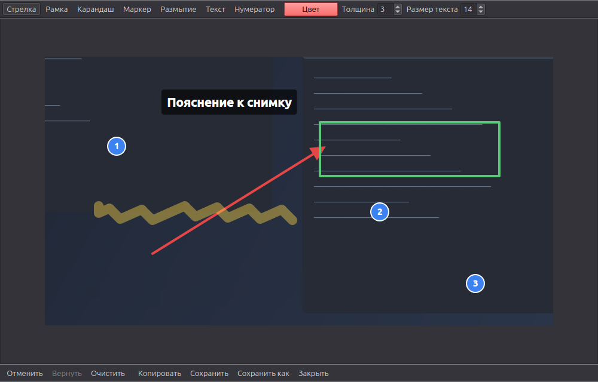
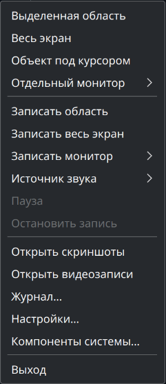
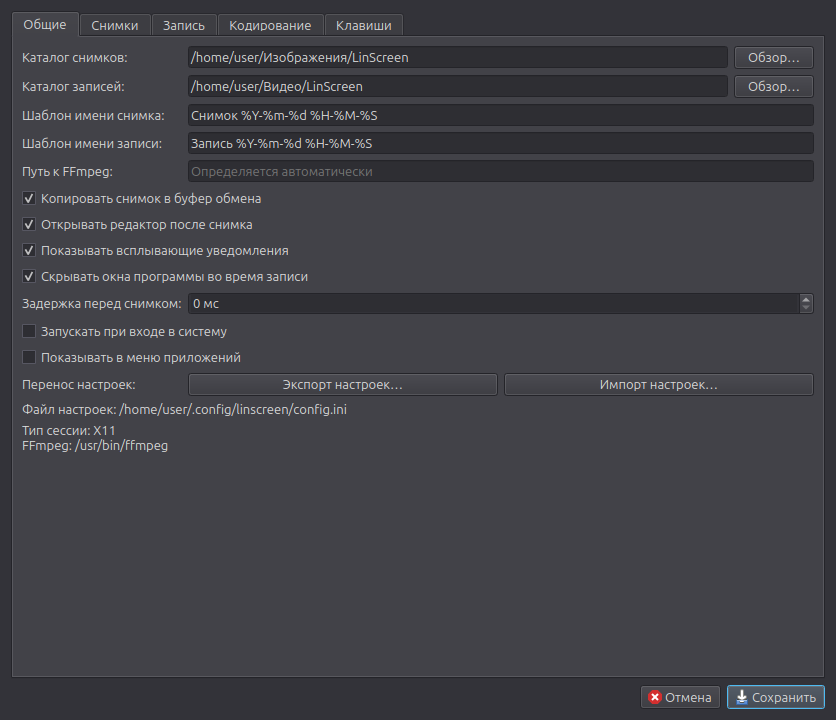
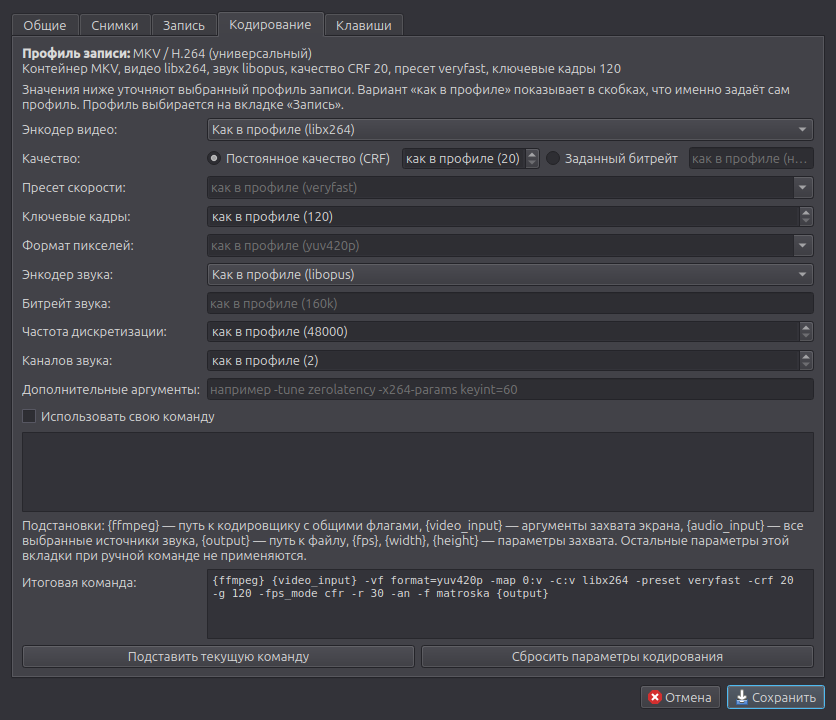

# LinScreen

LinScreen — программа для Linux, которая делает снимки экрана и записывает
видео с экрана. Она работает из системного трея: главного окна нет, все
действия доступны из меню значка, по горячим клавишам и командами из
терминала.

Что умеет программа:

* делать снимок выделенной области, всего экрана, одного монитора или окна
  под курсором;
* сразу после снимка открывать его в редакторе, где можно добавить
  стрелки, рамки, текст и номера шагов, размыть лишнее и обрезать;
* записывать видео области, монитора или всего экрана со звуком
  системы и микрофона, с паузой;
* сохранять запись в MKV, MP4, WebM, MOV, AVI, а также как анимацию
  GIF, WebP или APNG.

LinScreen работает и в сеансах **X11**, и в сеансах **Wayland** (KDE
Plasma, GNOME). Способ захвата экрана программа выбирает сама при запуске,
а для пользователя всё выглядит одинаково: те же меню, настройки, клавиши
и форматы файлов.

Справка по всем командам запуска — в [COMMANDS.md](COMMANDS.md).

## Возможности

**Снимки экрана**

* выделенная область, весь экран, отдельный монитор;
* подсветка окна под курсором: щелчок снимает окно целиком;
* лупа у указателя с координатами и цветом точки, чтобы выделять область
  с точностью до пикселя;
* форматы PNG, JPEG, WEBP, AVIF и BMP с настройкой качества;
* копирование в буфер обмена, быстрое сохранение, сохранение с выбором
  пути;
* задержка перед снимком, чтобы успеть раскрыть меню или подсказку.

**Редактор аннотаций**



Стрелка, рамка, карандаш, маркер, размытие, текст с подложкой, нумерация
шагов и обрезка. Аннотации перемещаются мышью, действия отменяются и
возвращаются. Размытие необратимо уничтожает содержимое области, поэтому
годится для скрытия паролей и личных данных.

**Запись экрана**

* область, весь экран или отдельный монитор;
* профили H.264, H.265, AV1, VP9, FFV1, ProRes; GIF, Animated WebP, APNG;
* звук с системного вывода и микрофона: отдельными подписанными
  дорожками или одной сведённой;
* пауза и продолжение без перекодирования;
* рамка вокруг записываемой области, которая в запись не попадает;
* файл корректно дописывается даже при выходе из программы или из сеанса.

**Работа в трее**



Цвет значка показывает состояние программы. Во время записи окна
программы скрываются, чтобы не попасть в кадр.

## Установка

Скачайте `LinScreen-x86_64.AppImage` из раздела [Releases](../../releases),
разрешите запуск и запустите:

```bash
chmod +x LinScreen-x86_64.AppImage
./LinScreen-x86_64.AppImage
```

В трее появится значок. Одиночный щелчок по нему делает снимок выделенной
области, правый щелчок открывает меню.

Ярлык в меню приложений и автозапуск включаются флажками в «Настройки →
Общие».

### Что нужно системе

Всё основное уже вложено в образ: FFmpeg, Qt, Python, GStreamer с клиентом
PipeWire и утилита буфера обмена. От системы нужны:

* рабочий стол с системным треем (в GNOME трей даёт расширение
  AppIndicator);
* для Wayland — служба порталов рабочего стола
  (`xdg-desktop-portal-kde` или `xdg-desktop-portal-gnome`) и PipeWire;
* FUSE — его требует сам формат AppImage.

Если чего-то не хватает, при запуске откроется окно «Компоненты системы».
Оно показывает, чего нет, даёт команды для установки выделяемым текстом и
умеет установить недостающее само (с запросом пароля). Открыть его вручную
можно из меню трея или командой `--check-system`.

Без трея программа продолжает работать: все действия доступны правым
щелчком по значку LinScreen в меню приложений.

### Разрешения в Wayland

В Wayland рабочий стол при первом снимке или первой записи спрашивает,
какие экраны разрешить программе. Отметьте все мониторы и оставьте
флажок «Сохранить параметры» — дальше снимки и запись идут без вопросов.
Разрешение можно отозвать в настройках рабочего стола.

## Использование

### Снимки

| Действие | Как |
|---|---|
| Снимок области | щелчок по значку в трее, `Print` или «Выделенная область» в меню |
| Весь экран, монитор | пункты меню, `Shift+Print` |
| Окно под курсором | пункт меню, `Alt+Print` или щелчок по подсвеченному окну |
| Выбрать весь монитор при выделении | `Enter` |
| Отмена выделения | `Esc` или правая кнопка мыши |
| Размер лупы | колесо мыши |

Подсветка окон работает в X11 и KDE Plasma; в GNOME окно выделяется
вручную. Выделение можно протянуть через границу мониторов. Снимок по умолчанию
копируется в буфер обмена и открывается в редакторе, файлы сохраняются в
`Изображения/LinScreen`.

### Редактор

| Действие | Клавиши |
|---|---|
| Выбор инструмента | `1`…`8` в порядке кнопок на панели |
| Применить обрезку | `Enter` или двойной щелчок |
| Удалить выбранную аннотацию | `Delete` |
| Отменить, вернуть | `Ctrl+Z`, `Ctrl+Shift+Z` |
| Копировать и закрыть | `Ctrl+C` |
| Сохранить и закрыть | `Ctrl+S` |
| Сохранить как | `Ctrl+Shift+S` |
| Закрыть без сохранения | `Esc` |

Крупный снимок вписывается в окно, масштаб меняется колесом мыши.

### Запись

1. Выберите источник звука: меню трея → «Источник звука».
2. Начните запись пунктом меню или сочетанием `Ctrl+Alt+R` и выделите
   область.
3. Остановите тем же сочетанием или через меню. Пауза — `Ctrl+Alt+P`.

Рамка вокруг области зелёная при выделении, красная во время записи и
жёлтая на паузе. Файлы сохраняются в `Видео/LinScreen`.

Раздельные звуковые дорожки поддерживают MKV, MP4 и MOV. В WebM и AVI звук
сводится в одну дорожку.

### Горячие клавиши

| Действие | По умолчанию |
|---|---|
| Снимок области | `Print` |
| Снимок всего экрана | `Shift+Print` |
| Снимок окна под курсором | `Alt+Print` |
| Запись: начать и остановить | `Ctrl+Alt+R` |
| Пауза записи | `Ctrl+Alt+P` |

Сочетания меняются в «Настройки → Клавиши». Если клавиша уже занята
другой программой, LinScreen сообщит, какой именно.

Сочетания регистрирует рабочий стол, и они видны в его настройках:

* KDE Plasma — «Параметры системы → Комбинации клавиш → LinScreen»;
* GNOME до версии 48 — «Настройки → Клавиатура → Комбинации клавиш →
  Дополнительные комбинации клавиш», записи «LinScreen: …»;
* GNOME 48 и новее — через системный запрос разрешения на сочетания.

Программа сообщает об этом при первом запуске, а изменения, сделанные в
настройках рабочего стола, переносит в свои настройки. Клавиши, которые
занимает сам GNOME (например, `Print` для встроенного снимка экрана),
нужно сначала освободить в его настройках.

Если рабочий стол не позволяет программе занять клавиши, те же действия
можно назначить на клавиши в его настройках как команды:

```bash
LinScreen-x86_64.AppImage --screenshot         # снимок области
LinScreen-x86_64.AppImage --screenshot-full    # весь экран
LinScreen-x86_64.AppImage --screenshot-window  # окно под курсором
LinScreen-x86_64.AppImage --record             # запись: старт и стоп
LinScreen-x86_64.AppImage --pause              # пауза записи
```

Команда передаёт действие уже работающей программе, а если программа не
запущена — запускает её и сразу выполняет действие.

## Настройки



Настройки открываются из меню трея и хранятся в
`~/.config/linscreen/config.ini` — обычном текстовом файле с примечанием к
каждому значению. Его можно править вручную, а кнопки «Экспорт настроек…» и
«Импорт настроек…» переносят его между компьютерами. Неверные значения в
файле не мешают запуску: они заменяются значениями по умолчанию.

Интерфейс по умолчанию русский; английский выбирается в «Настройки →
Общие → Язык интерфейса». Чтобы добавить язык, достаточно положить в
каталог `locale` файл `<код>.json` по образцу `locale/en.json`.

### Кодирование



Вкладка «Кодирование» уточняет выбранный профиль записи: кодек, качество
или битрейт, пресет скорости, ключевые кадры, параметры звука и
дополнительные аргументы FFmpeg. Внизу показана итоговая команда, поэтому
результат виден ещё до записи.

Флажок «Использовать свою команду» позволяет написать команду FFmpeg
целиком. В ней доступны подстановки:

| Подстановка | Чем заменяется |
|---|---|
| `{ffmpeg}` | путь к кодировщику вместе с общими флагами |
| `{video_input}` | аргументы захвата экрана |
| `{audio_input}` | все выбранные источники звука |
| `{output}` | путь к файлу результата (обязательна) |
| `{fps}`, `{width}`, `{height}` | параметры захвата |

Кнопка «Подставить текущую команду» заполняет поле готовым образцом.

## Диагностика

* «Журнал…» в меню трея показывает команды FFmpeg и их вывод; тот же текст
  пишется в `~/.cache/linscreen/linscreen.log`.
* Отчёты о сбоях — `~/.cache/linscreen/crash.log`.
* `LinScreen-x86_64.AppImage --check` выводит тип сеанса, найденный FFmpeg,
  кодеки, звуковые источники и состояние компонентов системы.

## Удаление

Кнопка «Настройки → Общие → Удалить программу из системы…» или команда
`--uninstall` убирает всё, что программа добавила в систему: ярлыки,
автозапуск, значок, сочетания клавиш в настройках KDE и GNOME и разрешения на
захват экрана. С ключом `--purge` удаляются и настройки с журналами.
После этого файл AppImage можно просто стереть.

## Протестировано

Работа программы проверена автором вживую в следующих условиях:

| Окружение | Условия |
|---|---|
| KDE Plasma 5.27, Wayland | два монитора, масштаб 1 и 1,25 |
| GNOME 46, Wayland | два монитора, трей через AppIndicator и без трея |
| Cinnamon, X11 | два монитора |

Система — Linux Mint 22.3 (основа Ubuntu 24.04), PipeWire 1.0, GStreamer
1.24; образ AppImage с вложенным FFmpeg 8.1 и вложенным GStreamer, а также
запуск из исходных текстов с системным FFmpeg 6.1.

Проверены: снимки всех видов, лупа, подсветка окон, редактор, запись
области, монитора и всего экрана, звук двумя дорожками, пауза, GIF, рамка
записи, буфер обмена, меню трея, настройки, английский интерфейс, окно
«Компоненты системы» с автоустановкой, удаление из системы.

Горячие клавиши по умолчанию в других окружениях (GNOME 48 и новее,
KDE Plasma 6) и дробный масштаб в GNOME пока не проверялись.

## Сборка из исходных текстов

```bash
git clone https://github.com/khameleonium/LinScreen.git
cd LinScreen
./build.sh
```

Сценарий создаёт виртуальное окружение, загружает сборку FFmpeg и
собирает `dist/LinScreen-x86_64.AppImage` (около 135 МБ) вместе с
GStreamer и клиентом PipeWire из системы сборки. Варианты:

```bash
LINSCREEN_BUNDLE_GSTREAMER=0 ./build.sh   # без вложенного GStreamer
LINSCREEN_BUNDLE_FFMPEG=0 ./build.sh      # без вложенного FFmpeg
LINSCREEN_FORMAT=onefile ./build.sh       # один файл PyInstaller
LINSCREEN_FORMAT=dir ./build.sh           # каталог без упаковки
```

Запуск без сборки (Ubuntu, Debian, Mint):

```bash
sudo apt install ffmpeg gstreamer1.0-tools gstreamer1.0-plugins-good gstreamer1.0-pipewire wl-clipboard
python3 -m venv .venv
.venv/bin/pip install -r requirements.txt
.venv/bin/python main.py
```

Устройство программы, соглашения и проверки для разработчиков описаны в
[FOR_DEVs.md](FOR_DEVs.md), заметки о решённых при разработке
проблемах — в [DEVLOG.md](DEVLOG.md).

## Лицензия

Код распространяется по лицензии [MIT](LICENSE): разрешено любое
использование, изменение, встраивание в собственные продукты и продажа.
Единственное условие — сохранять текст лицензии с именем автора в копиях и
производных работах.

Автор — [khameleonium](https://github.com/khameleonium).

Готовый образ AppImage дополнительно содержит сборку FFmpeg под лицензией
GPL, на которую распространяются требования GPL.

## Использованные компоненты

* [FFmpeg](https://ffmpeg.org/) — захват и кодирование; в образ входит
  сборка [BtbN/FFmpeg-Builds](https://github.com/BtbN/FFmpeg-Builds) под
  лицензией GPL, исходные тексты — в
  [репозитории FFmpeg](https://github.com/FFmpeg/FFmpeg).
* [Qt и PySide6](https://www.qt.io/qt-for-python) — интерфейс, лицензия
  LGPL.
* [GStreamer](https://gstreamer.freedesktop.org/) и
  [PipeWire](https://pipewire.org/) — доставка кадров экрана в Wayland,
  лицензия LGPL.
* [jeepney](https://gitlab.com/takluyver/jeepney) — обмен с порталами
  рабочего стола через D-Bus.
* [pynput](https://github.com/moses-palmer/pynput) и
  [python-xlib](https://github.com/python-xlib/python-xlib) — клавиши и
  окна в X11.
* [Pillow](https://python-pillow.org/) — сохранение изображений, в том
  числе AVIF.
